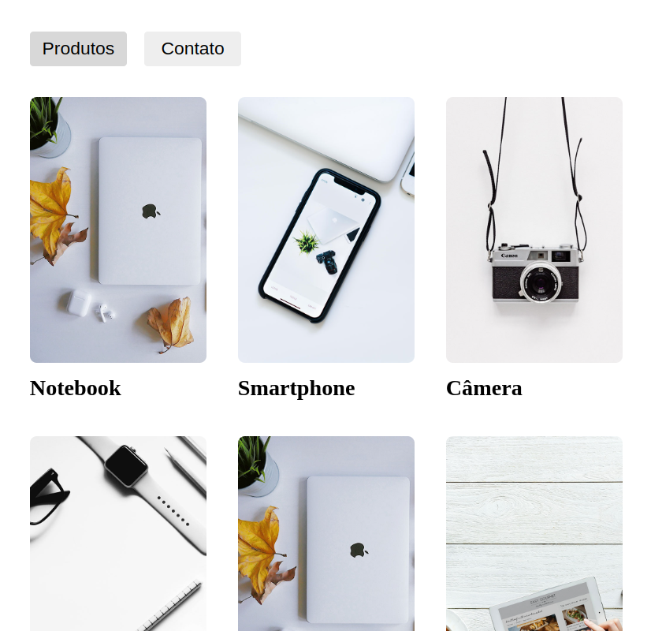

<h1 align="center"> Ranek Challenge </h1>

A Origamid React challenge.

  <a href="#-the-challenge">The challenge</a>&nbsp;&nbsp;&nbsp;|&nbsp;&nbsp;&nbsp;
  <a href="#-learning-goals">Learning goals</a>&nbsp;&nbsp;&nbsp;|&nbsp;&nbsp;&nbsp;
  <a href="#-technologies">Technologies</a>&nbsp;&nbsp;&nbsp;|&nbsp;&nbsp;&nbsp;
  <a href="#-deploy">Deploy</a>&nbsp;&nbsp;&nbsp;|&nbsp;&nbsp;&nbsp;
  <a href="#-project">Project</a>

  

 

  

 

## 🏆 The challenge

The challenge was to build a React application that fetch products data from an API and show a products galery on main page, a contact page and a product details page.

Users should be able to:

- Navigate between pages visualizing info and images from an external API.
- See product detail after clicking a product card on main page
- View the optimal layout depending on their device's screen size
- See hover and focus states for all interactive elements on the page

 

## 🎯 Learning goals

Put my recent knowledge through its paces using most of the React tools I'm studying in the last couple of months such as Components, Hooks, CSS-in-JS and React Router.

 

## 🚀 Technologies

This project was built using following libraries/frameworks:

- React
- Tailwind
- Styled Components
- React Router DOM
- Axios

 

## 🌎 Deploy

Live Site URL: [ranek-challenge](https://ranek-challenge-4mokm4i5j-tascintra.vercel.app/)

 

## 💻 Project
### Getting Started with Create React App

This project was bootstrapped with [Create React App](https://github.com/facebook/create-react-app).

### Available Scripts

In the project directory, you can run:

### `npm start`

Runs the app in the development mode.\
Open [http://localhost:3000](http://localhost:3000) to view it in your browser.

The page will reload when you make changes.\
You may also see any lint errors in the console.

### `npm test`

Launches the test runner in the interactive watch mode.\
See the section about [running tests](https://facebook.github.io/create-react-app/docs/running-tests) for more information.

### `npm run build`

Builds the app for production to the `build` folder.\
It correctly bundles React in production mode and optimizes the build for the best performance.

The build is minified and the filenames include the hashes.\
Your app is ready to be deployed!

See the section about [deployment](https://facebook.github.io/create-react-app/docs/deployment) for more information.

### `npm run eject`

**Note: this is a one-way operation. Once you `eject`, you can't go back!**

If you aren't satisfied with the build tool and configuration choices, you can `eject` at any time. This command will remove the single build dependency from your project.

Instead, it will copy all the configuration files and the transitive dependencies (webpack, Babel, ESLint, etc) right into your project so you have full control over them. All of the commands except `eject` will still work, but they will point to the copied scripts so you can tweak them. At this point you're on your own.

You don't have to ever use `eject`. The curated feature set is suitable for small and middle deployments, and you shouldn't feel obligated to use this feature. However we understand that this tool wouldn't be useful if you couldn't customize it when you are ready for it.

---

#### :memo: License

This project is under a MIT license.
